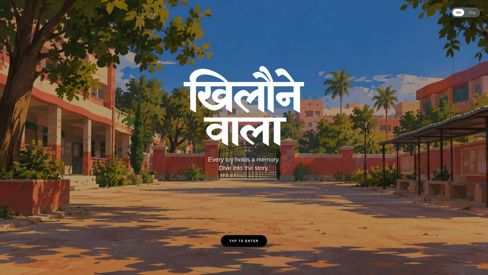
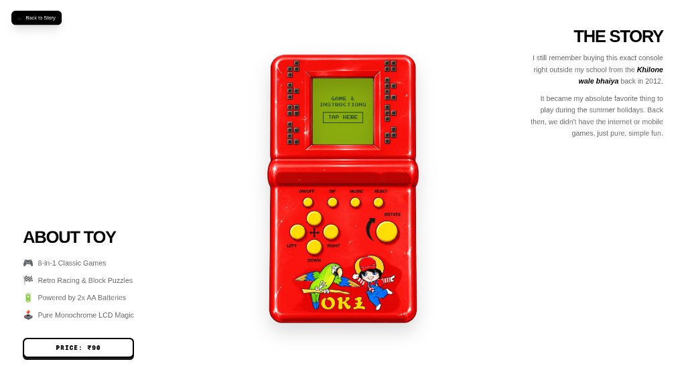
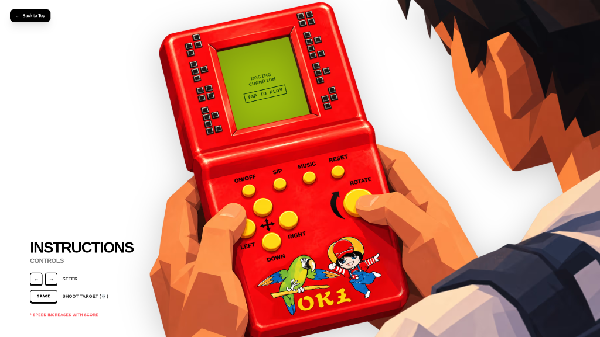
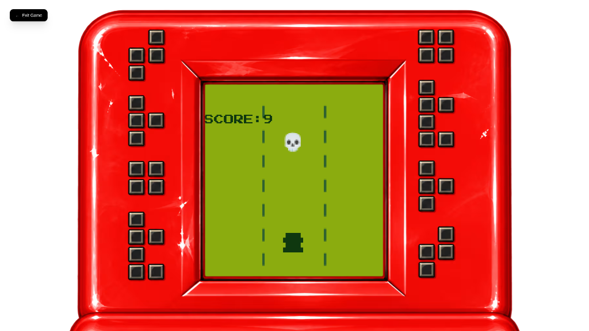
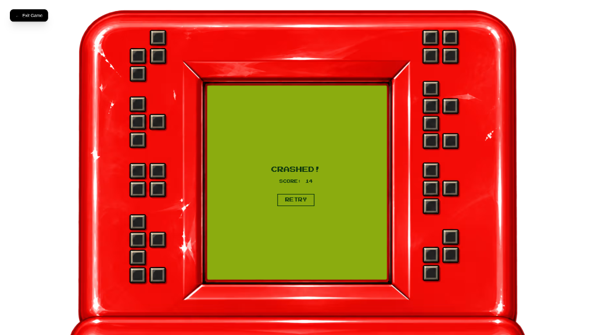
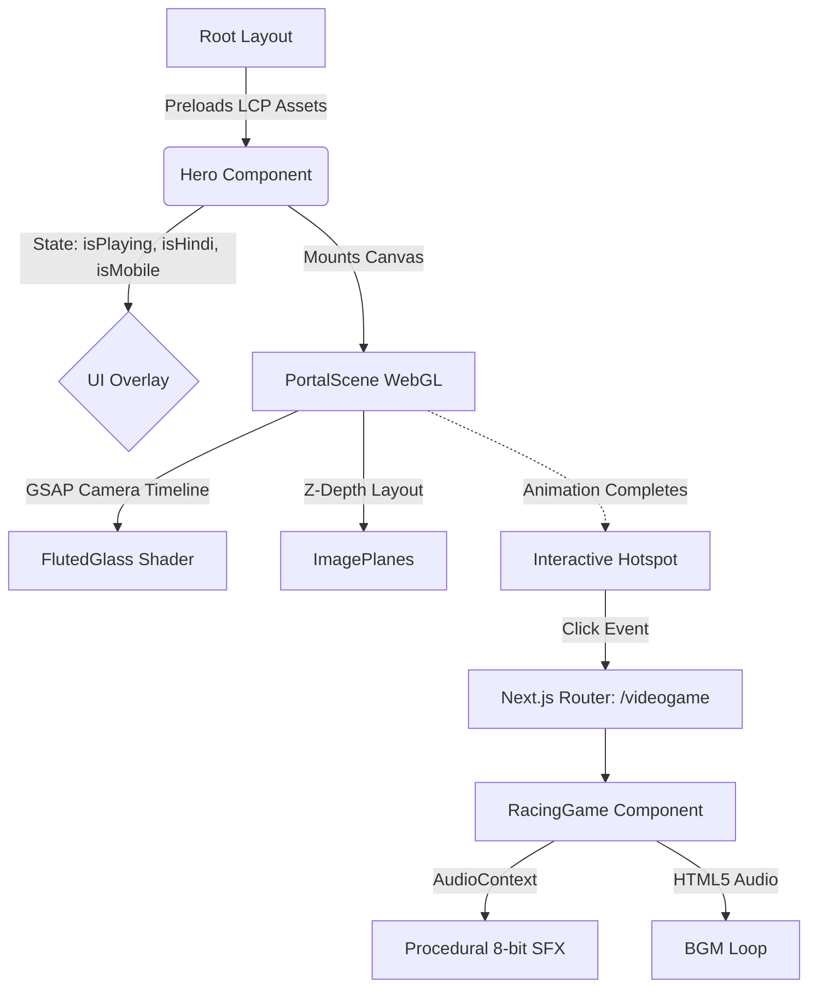

# Khilonewala / Toy Seller 🧸

> **A cinematic, WebGL-powered storytelling experience featuring a custom 3D camera timeline, dynamic fluted glass shaders, and a fully playable retro 8-bit racing game.**

[](https://toy.pratikpandey.in/)
[](https://toyseller.vercel.app)

<p align="center">
  
</p>
<p align="center">
  
  
</p>
<p align="center">
  
  
</p>
---

## 🌟 Highlights

*   **Cinematic WebGL Portal:** Seamless 3D depth navigation using React Three Fiber and custom GSAP camera timelines.
*   **Custom Shaders:** High-performance GLSL shaders for dynamic fluted glass and "ghosting" radial blur transitions based on camera velocity.
*   **Retro 8-Bit Mini-Game:** Built-in `<RacingGame />` featuring a custom `AudioContext` synth engine, wave-based enemy spawning, and responsive pixel-art rendering.
*   **Hyper-Optimized Assets:** Device-specific `.avif` textures with strategic LCP (Largest Contentful Paint) preloading injected directly into the document head.
*   **Bilingual & Responsive:** Seamless Hindi/English toggling and distinct UI overlays explicitly tailored for Desktop vs. Mobile experiences.

## 🛠 Tech Stack

*   **Framework:** [Next.js 16 (App Router)](https://nextjs.org/) & [React 19](https://react.dev/) — *For robust routing, modern React features, and optimal LCP rendering.*
*   **Styling:** [Tailwind CSS v4](https://tailwindcss.com/) + Turbopack — *For rapid, utility-first styling and lightning-fast builds.*
*   **3D & WebGL:** [Three.js](https://threejs.org/), [@react-three/fiber](https://docs.pmnd.rs/react-three-fiber/), `@react-three/drei` — *For declarative 3D scene building and camera management.*
*   **Animation:** [GSAP (GreenSock)](https://gsap.com/) & [Framer Motion](https://www.framer.com/motion/) — *GSAP for precision 3D camera timelines; Framer Motion for 2D UI presence and layout shifts.*
*   **Hosting:** [Vercel](https://vercel.com/) — *For edge caching and zero-config deployment.*

## 🚀 Quick Start

### Prerequisites
*   Node.js 20+
*   npm, yarn, pnpm, or bun

### Installation & Execution

```bash
# 1. Clone the repository
git clone <your-repo-url>
cd web

# 2. Install dependencies
npm install

# 3. Run the development server
npm run dev
```

Open [http://localhost:3000](http://localhost:3000) with your browser to see the result.

### Build for Production

```bash
npm run build
npm start
```

## 🔐 Environment Variables

This project is designed to be plug-and-play. **No environment variables are required** to run the base experience.

| Variable Name | Purpose | Required | Example |
| :--- | :--- | :---: | :--- |
| *None* | N/A | No | N/A |

## 📁 Project Structure

```text
web/
├── public/
│   └── assets/              # Highly compressed .avif images & .m4a/.mp3 audio files
│       ├── desktop/         # High-res textures for desktop viewport
│       ├── mobile/          # Optimized textures for mobile viewport
│       └── music/           # BGM and SFX
├── src/
│   ├── app/                 # Next.js App Router (layout, globals, /videogame route)
│   ├── components/
│   │   ├── FlutedGlass.tsx  # Custom WebGL Shader Material
│   │   ├── Hero.tsx         # Main entry component, handles state & 2D UI
│   │   ├── Hotspot.tsx      # 3D interactive trigger
│   │   ├── ImagePlane.tsx   # Z-depth planes with Ghosting/Blur shaders
│   │   ├── PortalScene.tsx  # WebGL Canvas scene & GSAP Timeline
│   │   └── RacingGame.tsx   # Canvas-based 8-bit racing mini-game
│   └── hooks/
│       └── useAudio.ts      # Global audio context management
```

## 🏗 Architecture Overview



## 🎨 Asset Pipeline

*   **Textures:** Split cleanly into `/desktop` and `/mobile` directories. We utilize highly compressed **`.avif`** formats over standard JPG/PNG/WebP, dramatically reducing the WebGL texture upload time and bundle payload.
*   **Audio:** Compressed `.m4a` and `.mp3` are used for Background Music. To save bandwidth and improve performance, the Racing Game uses a **Zero-Asset Procedural `AudioContext` Engine** to generate retro 8-bit sound effects (lasers, explosions, blips) entirely via math at runtime.
*   **LCP Preloading:** Handled manually in `src/app/layout.tsx` using viewport-specific media queries to guarantee instantaneous background loading.

## 🎬 Animation & Interaction System

*   **3D Camera:** Driven by a `gsap.timeline()` utilizing `power3.inOut` easing for a flawless 5-second cinematic sweep through the Z-axis (from `z: 5` to `z: -40`).
*   **Shaders:** Custom `useFrame` logic continuously calculates radial blur velocity and distance-based opacity ghosting based on the camera's real-time position.
*   **2D UI:** Orchestrated by Framer Motion using `<AnimatePresence />` to handle elegant layout shifts, text legibility overlays, and image swaps during language toggling.

## ⚡ Performance Budget

*   **Target FPS:** 60fps on mid-tier mobile and desktop devices.
*   **Bundle Size:** Offloading physics to custom frame-based math (no heavy physics engines like Cannon.js) and generating audio procedurally keeps the javascript bundle extremely light.
*   **LCP Preloads:** Media-query specific `<link rel="preload" as="image">` tags ensure the browser downloads the exact right background size before React even mounts.

## 🌐 Browser Support

The application is thoroughly tested and relies on modern features like WebGL2, ES6 Modules, and AVIF image decoding.

| Browser | Supported | Notes |
| :--- | :---: | :--- |
| **Chrome / Edge** | ✅ | Full WebGL2 & AVIF Support |
| **Firefox** | ✅ | Full WebGL2 & AVIF Support |
| **Safari (macOS)** | ✅ | Supported (Requires macOS 13+ for AVIF) |
| **iOS Safari** | ✅ | Supported (Requires iOS 16+ for AVIF) |
| **Android Chrome** | ✅ | Full WebGL2 & AVIF Support |

## ♿ Accessibility

*   **High Contrast:** Deep text shadows (`0 2px 15px rgba(0,0,0,0.6)`) are algorithmically applied to text overlays to guarantee AAA contrast ratios against the dynamic, moving WebGL backgrounds.
*   **Semantic Interactivity:** Custom buttons and language toggles are built with standard HTML tags to ensure keyboard navigability.
*   **Media Fallbacks:** Mobile users receive customized UI messaging indicating the experience is optimized for desktop, while retaining full touch/swipe playability.

## 🤝 Contributing

We welcome contributions! Please adhere to the following guidelines:
1.  **Branch Naming:** `feature/your-feature-name` or `fix/issue-description`.
2.  **Commit Style:** We follow [Conventional Commits](https://www.conventionalcommits.org/) (e.g., `feat: add new shader`, `fix: resolve audio context bug`).
3.  **Code Quality:** Ensure `npm run lint` passes before opening a Pull Request.

## 📜 Credits & Attributions

*   **Fonts:** Utilizing Vercel's [Geist](https://vercel.com/font) for clean UI, and Google's [Press Start 2P](https://fonts.google.com/specimen/Press+Start+2P) for retro game elements.
*   **Music:** Action drive racing BGM by Viacheslav Starostin.

## 📄 License & Contact

This project is open-source and available under the [MIT License](LICENSE).

*   **Live Demo:** [toy.pratikpandey.in](https://toy.pratikpandey.in/)
*   **Primary Domain:** [toyseller.vercel.app](https://toyseller.vercel.app)
